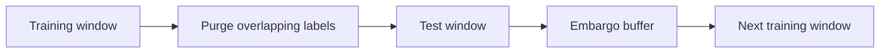

# ML Backtester

## Objective

Build a complete pipeline from ML signal → position → backtest, with an architecture that rigorously eliminates classic temporal biases and explicitly demonstrates the impact of those biases when left untreated.

## Project Structure

### 1. Data and Features

- Choose a simple but realistic universe, such as 10–20 liquid US stocks.
- Use daily data via `yfinance`, or intraday data if accessible.
- Build technical features such as momentum, realized volatility, relative volume, and RSI.
- Avoid future information in feature calculations. For example, use rolling-window normalization rather than the mean and standard deviation of the entire series.

### 2. ML Model

- Use a moderately complex model such as Gradient Boosting, LightGBM, XGBoost, or regularized regression.
- Keep the focus on the pipeline rather than model sophistication.
- Predict future return over a fixed horizon, such as five days.
- Transform the target into a directional signal or quantiles.

### 3. Walk-Forward Validation With Purge and Embargo

This is the core of the project:

- Implement rolling train/test windows over time rather than a single naive split.
- **Purge:** remove training observations whose label window overlaps the test period, avoiding information leakage through feature or label autocorrelation.
- **Embargo:** add a buffer period after each test window before resuming training, reducing leakage from residual autocorrelation in financial series.

### 4. With/Without Bias Comparison

This is the main selling point of the project:

- Run the same backtest without purge or embargo as a naive baseline.
- Compare performance metrics, especially the Sharpe ratio:

| Version | Validation method | Expected result |
| --- | --- | --- |
| Naive | No purge or embargo | Artificially inflated Sharpe |
| Corrected | Walk-forward split with purge and embargo | More realistic Sharpe |

- Quantify the gap between the two versions and explain why the naive Sharpe is inflated.

### 5. Realistic Backtest and Metrics

- Use simple position sizing, such as a signal-proportional position with a risk cap.
- Model realistic transaction costs, including spread and slippage. Optionally add square-root-law market impact to connect this project to Project 1.
- Track Sharpe ratio, Sortino ratio, maximum drawdown, turnover, and hit ratio.
- Apply Sharpe ratio deflation (López de Prado) when testing multiple feature or hyperparameter configurations to correct for multiple-testing bias.

## Tech Stack

| Area | Tools |
| --- | --- |
| Language and data | Python, pandas |
| Modeling | scikit-learn, LightGBM, or XGBoost |
| Backtesting | In-house implementation |
| Visualization | Equity curves and naive vs. corrected Sharpe comparisons |

An in-house backtester is recommended to keep full control over the purge and embargo mechanism, rather than using a library such as `backtrader` that could obscure the logic.

## Documentation Checklist

Explicitly document:

- The purge and embargo mechanism, including the temporal diagram above.
- The exact magnitude of the biased versus unbiased Sharpe gap, which is the strongest argument in interviews.
- The Sharpe deflation method and why it is necessary.
- Project limitations, such as the restricted universe and omitted financing costs, to demonstrate scientific honesty.