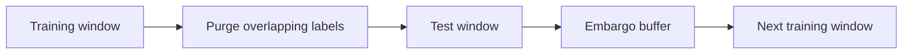

# The Purge and Embargo Mechanism

This document explains, and demonstrates with real numbers from this
repository's own pipeline, why a naive walk-forward split leaks information
and how purge and embargo remove that leakage. Implementation:
[ml_backtester/validation/splitters.py](../ml_backtester/validation/splitters.py).

## Why a naive split leaks

Each sample observed at date `t0` is labeled with the asset's return over the
next `horizon_days` trading days, so its outcome isn't actually known until
`t1 = t0 + horizon_days`. If `t0` falls in the training block but `t1` falls
inside (or after) the following test block, that training sample's label was
computed using price data from the test period — the model is trained on a
sliver of the future it's about to be "tested" on. Financial return series
also carry residual autocorrelation, so even a training sample whose label
resolves just *before* the test period can still share correlated noise with
the test period's earliest observations.

## The two corrections

- **Purge**: drop any training row whose label window `[t0, t1]` overlaps
  the test block — concretely, any row with `t1 >= test_start`.
- **Embargo**: after a test block ends, skip `embargo_days` trading days
  before the next training block is allowed to begin, absorbing residual
  autocorrelation across the boundary.

`WalkForwardSplitter` (naive) implements neither correction; `PurgedEmbargoedSplitter`
implements both. The two classes share one constructor and one `.split()`
signature (see `CLAUDE.md`), so `experiments/run_comparison.py` swaps between
them with a single argument while the data, features, model, and costs stay
identical — isolating the Sharpe gap to the validation methodology alone.

## Purge, demonstrated on real data

Run with `Config()`'s actual defaults — the full 15-name `DEFAULT_UNIVERSE`,
2015-01-01 to 2024-12-31, `horizon_days=5`, `train_window_days=30`,
`test_window_days=10`:

| | Naive train rows | Corrected train rows | Rows purged |
| --- | --- | --- | --- |
| Fold 0 | 450 | 375 | 75 |

75 rows purged = 15 tickers × 5 trading days (`horizon_days`) — exactly the
last `horizon_days` dates of the training block across every ticker, whose
labels resolve on or after the test block's first date. That's 17% of the
training block gone (`horizon_days / train_window_days = 5/30`). This
matches the invariant enforced by `PurgedEmbargoedSplitter.split()` and
checked directly in
`tests/validation/test_splitters.py::test_purged_splitter_never_leaves_a_leaking_row`.

`train_window_days=30` is deliberately short relative to a multi-year
institutional retrain cadence: the purged fraction is `horizon_days /
train_window_days`, so a 3-year training window (756 days) would purge only
~0.7% of each fold — too little to visibly move the Sharpe ratio. A 30-day
window makes the mechanism's effect large enough to see in the numbers (see
[bias_comparison.md](bias_comparison.md)), which is why it's the project's
default rather than a larger, more "realistic-looking" window that would
quietly hide the point this project exists to make.

## Embargo, demonstrated on real data

Same run, `embargo_days=5`:

| | Fold 0 test ends | Fold 1 train starts |
| --- | --- | --- |
| Naive | 2015-06-23 | 2015-06-24 (next trading day) |
| Corrected | 2015-06-23 | 2015-07-01 (5 trading days later) |

The naive splitter resumes training the very next trading day after the
test block ends. The corrected splitter waits `embargo_days` trading days
(2015-06-24 through 2015-06-30, five weekdays), so the next training block's
earliest observations aren't contaminated by autocorrelation with the test
period that just ended. Skipping those 5 days per fold also means the
corrected splitter fits into fewer folds overall over the same date range —
60 for the naive splitter vs. 54 for the corrected one, in this run — so the
two runs' out-of-sample returns aren't drawn from identical calendar
periods; see [limitations.md](limitations.md).

## Net effect

Both corrections only ever *remove* training data relative to the naive
splitter — they never add information. Any Sharpe improvement the corrected
pipeline shows over the naive pipeline (see
[bias_comparison.md](bias_comparison.md)) is therefore not from a better
model or more data; it's the naive number being inflated by leakage that the
corrected number no longer benefits from.
